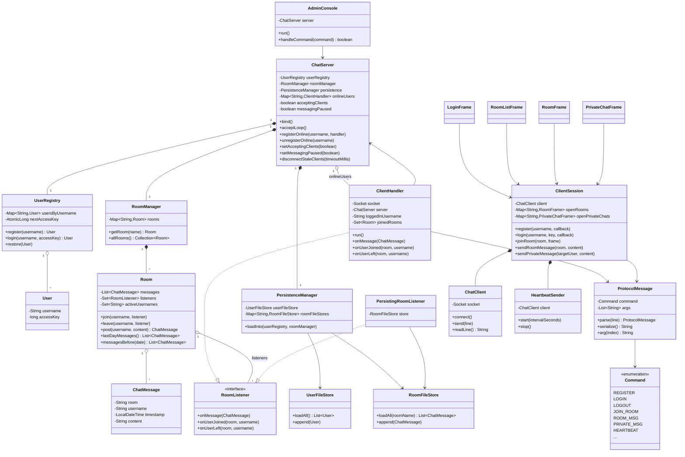

# Diagrama de clases — Práctica MTPA

Diagrama de las clases más relevantes de la aplicación (servidor, cliente y protocolo
compartido). Se omiten las excepciones de dominio, los getters triviales y las ventanas
Swing menos relevantes para centrar el diagrama en la arquitectura. GitHub renderiza
este bloque Mermaid automáticamente al ver el fichero.

## Notas sobre las relaciones clave

- `ChatServer` es el punto central: compone `UserRegistry`, `RoomManager` y
  `PersistenceManager`, y mantiene el mapa de usuarios online para poder enrutar
  mensajes privados y estadísticas de administración.
- `ClientHandler` implementa `RoomListener` para poder recibir en tiempo real los
  eventos de los salones a los que está suscrito (mensajes nuevos, entradas y
  salidas de otros usuarios) y reenviarlos al socket del cliente.
- `PersistingRoomListener` también implementa `RoomListener`: se suscribe a cada
  `Room` únicamente para volcar los mensajes nuevos a disco, sin contar como un
  usuario activo del salón.
- `ProtocolMessage` + `Command` son el núcleo del protocolo de aplicación (Capa 7)
  descrito en `protocolo.md`; tanto `ClientHandler` (servidor) como `ClientSession`
  (cliente GUI) dependen de ellos para serializar/parsear cada línea del protocolo.
